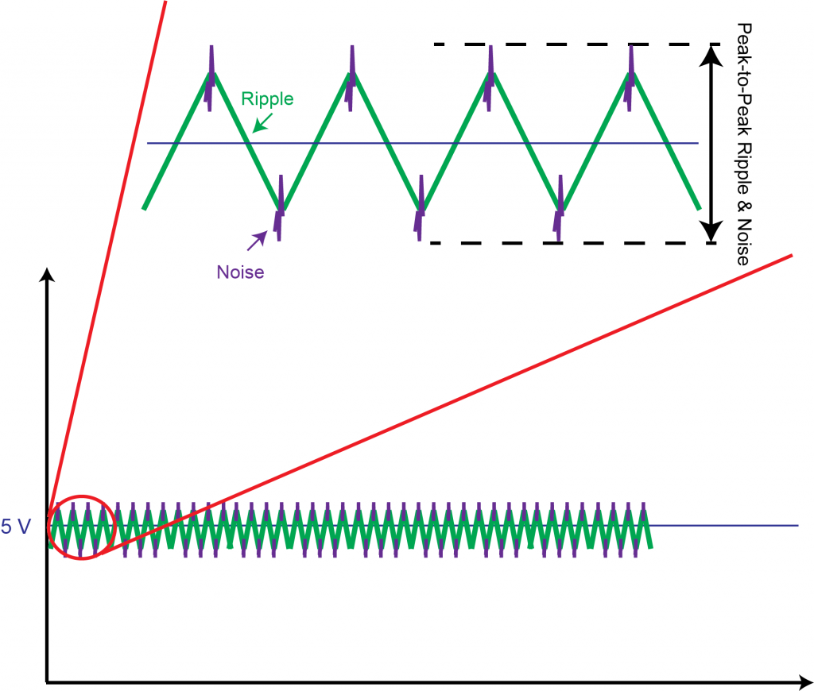
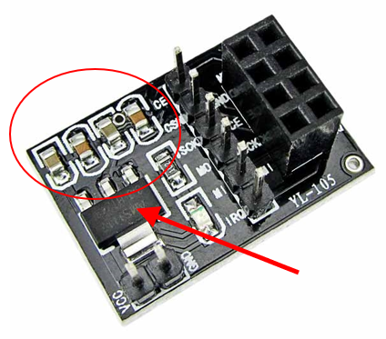
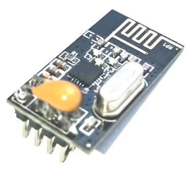
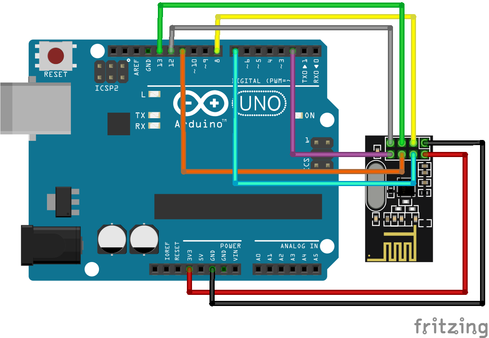
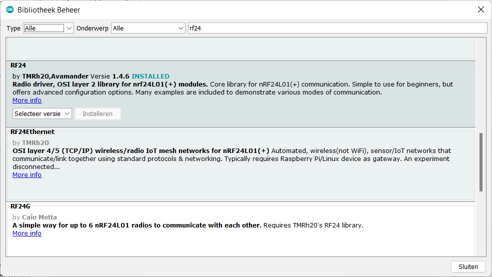

# NRF24

In heel veel toepassing komt het wel eens voor dat er nood is aan draadloze communicatie, maar in sommige gevallen kan het gebruik van WiFi of Bluetooth uit den boze zijn wegens te complex of een te groot vermogensverbruik. Denken we hierbij aan IoT toepassingen waar er datacaptatie nodig is op afstand, bij robotica waar kabelverbindingen niet mogelijk zijn of zelfs domotica, om eenvoudig een schakelaar bij te plaatsen zonder dat er hoeft gekapt en geboord te worden in muren. 

Zeker bij dit laatste voorbeeld is het gebruik van een draadloze technologie die weinig vermogen vereist bijzonder belangrijk, want het toestel moet gedurende enkele jaren meegaan op één batterij. 

Als het gaat over _low power_ draadloze communicatie is Nordic Semiconductors wellicht de grootste speler op de markt. Omwille van die reden vinden we dan ook in de elektronica heel dikwijls draadloze modules terug die gebruik maken van een IC van deze fabrikant. Hierbij is de NRF24 IC wellicht de meest gekende, die ook reeds zijn _counterfeits_ kent zoals de Si24. Deze laatste is echter volledig namaak, gebasseerd op een verouderd procestechnologie waardoor het verbruik hoger ligt en de gevoeligheid een stuk slechter is.


## De draadloze module

De NRF24 alleen als IC is niet bruikbaar. Deze heeft nog allerlei randcomponenten nodig voordat deze kan gebruikt worden. In de handel zijn dan ook veel (identieke, volgens het voorbeeld van Nordic) modules te vinden waarop deze IC is gemonteerd, samen met zijn randcomponenten:
1. Antenne (meestal opgenomen als PCB trace)
1. RF filter
1. Voedingsstabilisatie (condensatoren, waarbij meestal __te weinig__ is voorzien. Zie hiervoor verder bij [voedingsprobleem](#voedingsproblemen))
1. Oscillator
1. Breakout pinnen (meestal, soms via [castellations](https://www.eurocircuits.com/blog/castellations-on-a-pcb/))


### Spectrum

De NRF24 is ontworpen om te werken in de 2,4GHz ISM band (vandaar ook zijn naam: **N**ordic **R**adio **F**requency **2**.**4**). Deze band is wellicht bij iedereen gekend als de band voor WiFi, wat klopt. De IC deelt het spectrum met deze van WiFi (en nog veel andere toepassingen, behorende tot de **I**ndustrial, **S**cientific en **M**edical werelden). 


Op bovenstaande afbeelding zijn de kanalen te vinden waarop je via WiFi kan communiceren (14 in totaal, waarbij er slechts 3 zijn die geen overlap kennen, namelijk 1, 6 en 11). Ieder kanaal neemt 22MHz in beslag. Deze grote bandbreedte is essentieel om snelheden te halen van 100'den Mbits (afhankelijk van de gebruikte modulatietechniek). Merk op dat de laagste (center) frequentie 2412MHz is, dus als ondergrens 2412-11=2401MHz. De hoogste (center) frequentie bedraagt 2484MHz, dus 2484+11=2496MHz. De ITU heeft  bepaald dat op wereldwijd niveau alle frequenties tussen 2,4GHz en 2,5GHz door iedereen zonder licentie mogen gebruikt worden. WiFi valt hier dus mooi binnen.

Voor de NRF24 is dit echter anders. Deze heeft een maximale datarate van enkele MBit's, waardoor de vereiste bandbreedte per kanaal stukken kleiner is. Voor het gemak van uitleg is de manier van moduleren achterwege gelaten (voor wie interesse hierin heeft, de NRF24 gebruikt [GFSK](https://en.wikipedia.org/wiki/Frequency-shift_keying#Gaussian_frequency-shift_keying)). Dit resulteert in veel meer kanalen die kunnen gebruikt worden.

Volgens de datasheet kan de IC gebruikt worden bij volgende frequenties:

> The nRF24L01+ is designed for operation in the world wide ISM frequency band at 2.400 - 2.4835GHz.

Wanneer we echter verder kijken in de datasheet zien we het volgende:

> * 126 RF channels
> * 1MHz non-overlapping channel spacing at 1Mbps
> * 2MHz non-overlapping channel spacing at 2Mbps

De NRF24 kan ingesteld worden om 126 kanalen te gebruiken, en bij 1Mbit hebben deze elk maximaal 1MHz bandbreedte. Het eerste kanaal start met een frequentie van 2400MHz, het volgende 2401MHz enzoverder. De aandachtige lezer zal wellicht opgemerkt hebben dat de kanalen vanaf 97 en verder niet gebruikt worden door WiFi, en dat deze dan ook bij uitstek geschikt zijn om ongestoord te communiceren. Wel is op te merken dat dit resulteert in een frequentie die buiten het door het ITU toegekende spectrum valt, en men mogelijk illegaal bezig is.

### Voeding en vermogen

De NRF24 werkt op 3,3V en **NIET** op 5V. Een spanningsbereik van 1,9 tot 3,6V is acceptabel. Bij lagere spanningen zal de module niet werken (wat op zich geen probleem is), bij hogere spanningen zal de module stuk gaan (wat wel een probleem is). De digitale pinnen (in- en uitgangen) zijn echter wel 5V compatibel, en kunnen dus rechtstreeks aangesloten worden op bijvoorbeeld een Arduino [UNO](#uno). Bij een [ESP8266](#esp8266) en een [ESP32](#esp32) is er totaal geen probleem.

Het zendvermogen van de module is instelbaar in een viertal stappen, waarbij ieder vermogen in een zeker verbruik resulteert. Met het extra vermogen zal er wel een grotere afstand kunnen overbrugd worden, maar zal ook een groter verbruik gepaard gaan. Houd rekening dat de voeding deze pieken (tijdens zenden) moet kunnen leveren. Zie hiervoor [voedingsprobleem](#piekvermogen).

| Versterking [dBm] | Verbruik [mA] | Code  |
| :---------------: | :-----------: | :----:|
| 0dBm | 11,3mA | `RF24_PA_MAX` |
| -6dBm | 9mA | `RF24_PA_HIGH` |
| -12dBm | 7,5mA | `RF24_PA_LOW` |
| -18dBm | 7mA | `RF24_PA_MIN` |

Naast het vermogen die essentieel is om te kunnen zenden zal de controller en de ontvangstlogica in de chip ook nog een deel vermogen opnemen, namelijk 13,5mA! Dit zal voortdurend gebeuren tijdens het luisteren (via `void startListening(void)`). Dit verbruik kan echter grotendeels worden uitgeschakeld via commando's, om het zo langer op een zelfde batterijlading te kunnen uithouden. Dit valt echter buiten het bestek van deze module, en voor hen die hierin interesse hebben wordt er verwezen naar volgende [youtube video](https://youtu.be/MvjpmsH2wKI) en de juiste commando's hiervoor, namelijk `void powerDown(void)` en `void powerUp(void)`.

### Aansluitingen


De NRF24 communceert met de _host_ controller via een SPI-bus. Deze heeft volgende aansluitingen van doen:
* MOSI (**M**aster **O**ut **S**lave **I**n): Data van _host_ controller naar NRF24
* MISO (**M**aster **I**n **S**lave **O**ut): Data van NRF24 naar _host_ controller
* SCK (**S**erial **C**loc**K**): Transmissie klok van _host_ controller naar NR24

Naast de essentiële aansluitingen zijn er ook nog drie andere aansluitingen, waarvan de eerste twee essentieel zijn voor de goede werking
* CSN (**C**hip **S**elect i**N**verted): Op de SPI bus kunnen meerdere slaves aanwezig zijn. Het laagmaken van deze pin activeert de NRF24 om deel te nemen aan buscommunicatie.
* CE (**C**hip **E**nable): Deze pin moet altijd hoog zijn opdat de NRF24 zou kunnen werken. Deze laagmaken plaatst de NRF24 in ultra low power mode (900nA).
* IRQ (**I**nterrupt **R**e**Q**uest): De NRF24 kan deze pin hoog/laag maken bij ontvangst van data om zo de _host_ controller te informeren van ontvangst. Zie hiervoor [volgend voorbeeld](#irqs)

## Het gebruikte protocol

Om (draadloze) communicatie te kunnen doen werken is er nood aan afspraken. Er zijn afspraken gemaakt over de signaalniveau's die uitgestuurd mogen worden, welke modulatie er toegepast wordt enzoverder. Dit zijn afspraken op niveau 0 (fysische laag) van het [OSI-model](https://nl.wikipedia.org/wiki/OSI-model). Natuurlijk moeten zowel zender als ontvanger dezelfde afspraken hanteren, of deze zullen elkaar niet verstaan. 


Maar communicatie gaat verder dan dit. Naast de afspraken op niveau 0 moeten ook concrete afspraken gemaakt worden op de laag er boven, namelijk laag 1 (datalink laag):
* Wanneer begint en wanneer eindigt een bericht?
* Hoe weet een toestel dat de data voor hem bestemd is?
* Hoe ben je zeker dat de ontvangen data niet corrupt is?

Bij de modulatietechniek wordt hier niet over gesproken, aangezien de modulatietechniek zich situeert op niveau 0 van het OSI model. Nordic Semiconductors heeft echter wel een eigen protocol toegevoegd bovenop de modulatietechniek, namelijk het _enhanced ShockBurst_ protocol, wat zich situeert op niveau 1, 2 & 4. In dit protocol (zie hieronder) is er ruimte gelaten voor de data van de gebruiker, die op zijn beurt een hogere laag van het OSI model kan implementeren. Meestal zal dit meteen laag 7 zijn (applicatie laag).

### (Enhanced) ShockBurst

De NRF24 maakt  gebruikt van een propriëtair protocol die zich situeert op laag 1 en 2 van het OSI-model. Het is een heel eenvoudig protocol die kan opgedeeld worden in vijf verschillende velden:

| Veld | Grootte | OSI-laag | Nut |
| :--: | :-----: | :------: | :-: |
| Preamble | 1 byte | 1 (datalink) | Aanduiding begin van nieuw bericht |
| Address | 3-5 bytes | 2 (netwerk) | Addressering van ontvanger |
| Packet control | 9 bytes | 1 (datalink) | Beschrijving frame opbouw |
| Payload | 0-32 bytes | 7 (applicatie) | Vrij in te vullen veld voor de gebruiker |
| CRC | 1-2 bytes | 1 (datalink) | Foutcontrole corrupte data |

Als gebruiker hebben wij nood aan data verzenden naar een specifieke gebruiker. De velden die voor ons van interesse zijn beperken zich dan ook tot het _adres_ en de _payload_. De overige velden zullen ingevuld worden doordat we gebruik maken van een bibliotheek.

### Auto ACK

Het _Enhanced_ protocol laat toe dat er controle gebeurd op het al dan niet feilloos verzenden van data. De controle hiervan wordt beschreven op niveau 4 (transport laag) van het OSI-model, die meer toebehoort aan de software dan aan de hardware. Nordic heeft echter beslist dit op te nemen in hun controller, zodat de software voor de eindgebruiker eenvoudiger wordt. Het _packet control_ veld wordt hiervoor gebruikt en verder opgedeeld in drie nieuwe velden:

| Veld | Grootte | OSI-laag | Nut |
| :--: | :-----: | :------: | :-: |
| Payload lenght | 6 bytes | 1 (datalink) | Lengte van de payload (i.p.v. eerdere fixed length) |
| Packet ID | 2 bytes | 4 (transport) | Unieke ID van het pakket |
| No ACK | 1 byte | 4 (transport) | ACK request |

Het _packet ID_ en de _no ACK_ kunnen nu gebruikt worden om een bericht te identificeren. Er kan hier expliciet gevraagd worden aan de ontvanger om een bericht terug te sturen wanneer deze het pakket feilloos heeft ontvangen. Hiervoor moet de ontvanger een bericht terugsturen met dezelfde ID. Pas wanneer de zender dit pakket heeft ontvangen kan men er zeker van zijn dat het bericht 100% zeker de ontvanger heeft bereikt. 

Merk op dat een pakket verloren/corrupt kan geraken tijdens zenden van zender naar ontvanger, maar eveneens omgekeerd. Het kan dus ook zijn dat de ontvanger eenzelfde pakket meerdere malen zal ontvangen. Hiervoor dient eveneens de ID die toelaat te controleren of het pakket reeds feilloos is ontvangen.

# Gebruik van de NRF24

## Voedingsproblemen

### Storing

De NRF24 IC is een analoog/digitale IC, waarbij het analoge gedeelte een zeer hoge ingangsgevoeligheid heeft zodat dit feilloos zeer zwakke RF signalen kan opvangen. Storing op de voeding zal dan ook meestal zorgen voor corrupte data bij ontvangst. Het is dan ook belangrijk dat de gebruikte voeding voldoende stabiel is en geen gesuperponeerd AC signaal bevat. Dit AC signaal kan er typisch komen van een schakelende regelaar. 



Op bovenstaande afbeelding is duidelijk te zien dat er  twee soorten storingen zijn:
* Ripple: De regelaar kan pas regelen als er een fout is (zie regeltechnieken 6de middelbaar). De uitgangsspanning moet dus afwijken vooraleer er kan bijgeregeld worden. Dit zorgt voor een AC-signaal met een zekere amplitude. Bij hedendaagse regelaars is dit weinig waarneembaar. 
* Noise: De regelaar, meestal van het type DC/DC zal zijn uitgangstrap in- en uitschakelen. Bij het in- en uitschakelen zullen er overgangsverschijnselen ontstaan aangezien het altijd een RLC-keten is die wordt aangestuurd. Deze overgangsverschijnselen zorgen voor _ringing_ en zijn gedempt (doven uit). De amplitude van deze _ringing_ is echter niet verwaarloosbaar en zorgt voor ontvangstproblemen.

Het is dan ook belangrijk de NRF24 te voeden vanuit een LDO-regelaar i.p.v. een geschakelde regelaar. Indien men toch een geschakelde regelaar wil gebruiken is het best deze op een hogere spanning te nemen (bijvoorbeeld 5V) en deze te laten volgen door een LDO (naar 3,3V). In de handel zijn hiervoor overgangsbordjes te vinden, gelijkend op deze hieronder waarop duidelijk een LDO (type AMS1117-3.3) met bijhorende onkoppelcondensatoren te zien is.



### Piekvermogen

De NRF24 is in staat in zeer korte tijd een groot piekvermogen op te nemen, nodig om te kunnen zenden. Wanneer de NRF24 gevoed wordt via lange jumperdraadjes (wat meestal het geval is in labo opstellingen) kan de gevormde weerstand tussen voeding en NRF24 er voor zorgen dat dit niet kan geleverd worden. Dit probleem is niet op te merken in de communicatie (digitaal), maar situeert zich ter hoogte van het analoge gedeelte (transmitter/receiver). Dit zal altijd resulteren in ontvangstfouten, wat op applicatieniveau wel kan waargenomen worden. 

Dit euvel is eenvoudig op te lossen door zo dicht mogelijk bij de NRF24 een capaciteit van voldoende grootte te plaatsen (grootorde microfarads). Deze kan eenvoudig op de connector bijgesoldeerd worden. Respecteer hiervoor wel de VCC en de GND!



## Interfacing

Het aansluiten van de NRF24 op een microcontroller is vrij evident. In totaal zijn er een drietal zaken die moeten verbonden worden:
* Voeding: **Opgelet** deze werkt op 3,3V!
* SPI: Dit zijn meestal vaste pinnen, zie hiervoor de voorbeelden hieronder.
* Controlesignalen: Deze zijn meestal vrij te kiezen en via software instelbaar.

Voor iedere controller wordt de specifieke lijst gegeven van aansluitingen met hierbij detail over vrijheden.

### UNO



| NRF24 pin | UNO pin | Vrijheid | Opmerkingen |
| :--: | :-----: | :------: | :-: |
| VCC | 3V3 | NEE | **Opgelet: verbind niet met de 5V!** |
| GND | GND | JA; er zijn meerdere GND pinnen |  |
| CE | P8 | JA; iedere digitale output kan gebruikt worden | Kan ook rechtstreeks met de 3V3 of 5V verbonden worden |
| CSN | P7 | JA; iedere digitale output kan gebruikt worden |  |
| SCK | P13 | NEE |  |
| MOSI | P11 | NEE |  |
| MISO | P12 | NEE |  |
| IRQ | P2 | NEE | Deze verbinding is optioneel, nodig indien gebruik moet gemaakt worden van interrupts |


### ESP8266

### ESP32

## Voorbeeldcode

### Basis

Met deze code is het mogelijk data te versturen van zender naar ontvanger. Er kan geselecteerd worden in de code welke rol het toestel moet hebben, dit a.d.h.v. een define:
> `#define ROLE_TX  false      //can be true, any other value will result in RX (even if left away)`

De zender verzend vervolgens een byte data naar de ontvanger, waarbij de inhoud een teller is die na ieder bericht verhoogd wordt met 1. De ontvanger geeft deze teller weer op de seriële monitor.

Merk op dat er gebruik wordt gemaakt van een externe bibliotheek die je moet toevoegen aan je systeem. Ga hiervoor naar _bibliotheken beheren_ binnen de Arduino omgeving en zoek vervolgens op _RF24_. Installeer vervolgens de bibliotheek met exact deze naam.



::: tip
**Pinnen aanpassen**

Zoals eerder aangehaald kun je de CSN en de CE pin zelf kiezen. Je kan dit aanpassen in de code a.d.h.v. volgende defines:

```cpp
#define SPI_CSN 7   //pin to select NRF24
#define SPI_CE  8   //pin to enable NRF24
```

:::

::: tip
**Adressering aanpassen**

Mocht je meerdere NRF24's gebruiken in een toepassing, dan moet je deze correct kunnen addresseren. Er wordt een verbinding opgezet van een _write pipe_ met een bepaald adres naar een _read pipe_ met **eenzelfde** adres. Dit adres kun je wijzigen a.d.h.v. volgende lijn code:

```cpp
const byte address[6] = {0x2B, 0x96, 0x09, 0xB6, 0x35}; //unique address for NRF24
```

:::

Aan de rest van het programma hoeft er op zich niets aangepast te worden.

#### UNO

```cpp
#include <SPI.h>    //needed for SPI communication with NRF24
#include <RF24.h>	//needed for L1, L2 and L4 communications with NRF24

#define ROLE_TX  false      //can be true, any other value will result in RX (even if left away)

#define SPI_CSN 7   //pin to select NRF24
#define SPI_CE  8   //pin to enable NRF24

const byte address[6] = {0x2B, 0x96, 0x09, 0xB6, 0x35}; //unique address for NRF24

RF24 radio(SPI_CE, SPI_CSN);  //create NRF24 object to communicate with visualisation

uint8_t rxBuff[32];

void setup() {
  Serial.begin(115200);
  Serial.println("NRF24 on Arduino UNO");
   #if defined(ROLE_TX) && (ROLE_TX == true)
    Serial.println("\tRole = transmitter");
   #else
    Serial.println("\tRole = receiver");
   #endif
  if(radio.begin()){
    if(radio.isChipConnected()){
      if(radio.isPVariant()){
        Serial.print("NRF:\tPro ");
        radio.enableDynamicPayloads();    //short messages (not 32 bytes)
        radio.enableAckPayload();         //piggy back data with ACK
        radio.setDataRate(RF24_250KBPS);  //set the data rate
      }else{
        Serial.print("NRF:\tBasic ");
        radio.setDataRate(RF24_1MBPS);    //set the data rate
      }
      Serial.println("radio detected");
      radio.setPALevel(RF24_PA_MAX);      //set the power of the device
      radio.setChannel(100);              //set the channel to 2,5GHz
      radio.setRetries(7,3);              //set the retries (space them in time)
    }else{
      Serial.println("ERR:\tNo radio detected!");
      while(1); //no need to continue
    }
  }else{
    Serial.println("ERR:\tFailed to create RF24 object");
    while(1); //no need to continue
  }
  #if defined(ROLE_TX) && (ROLE_TX == true)
    radio.stopListening();                  //Set module as transmitter
    radio.openWritingPipe(address);         //set the address
  #else
    radio.openReadingPipe(1, address);  //set the address
    radio.startListening(); //Set module as receiver
  #endif
}

uint8_t cnt = 0;

void loop() {
  #if defined(ROLE_TX) && (ROLE_TX == true)
    if(radio.write(&cnt, 1)){
      if(radio.isAckPayloadAvailable()){
          Serial.print("NRF:\tTX OK, piggyback data received (");
          Serial.print(radio.getDynamicPayloadSize());
          Serial.print(" bytes): ");
          radio.read(&rxBuff, radio.getDynamicPayloadSize());
          for(uint8_t i=0;i<radio.getDynamicPayloadSize();i++){
            Serial.print("0x");
            Serial.print(rxBuff[i],HEX);
            Serial.print(" ");
          }
          Serial.println();
      }else{
          Serial.println("NRF:\tTX OK, no piggyback data");
      }
      cnt++;
    }else{
        Serial.println("NRF:\tTX failed!");
    }
    delay(1000);
  #else
    if(radio.available()){
      //there is data received, display the data
      radio.read(&rxBuff,radio.getDynamicPayloadSize());
      //show the content
      Serial.print("NRF:\tRX: ");
      Serial.println(rxBuff[0]);
    }
  #endif
}
```

#### ESP8266

#### ESP32

### Piggyback data

### IRQ's

#### UNO

#### ESP8266

#### ESP32

### Good practice

#### Structures

#### Union
