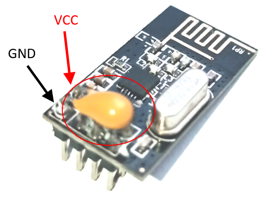

## NRF24

In heel veel toepassing komt het wel eens voor dat er nood is aan draadloze communicatie, maar in sommige gevallen kan het gebruik van WiFi of Bluetooth uit den boze zijn wegens te complex of een te groot vermogensverbruik. Denken we hierbij aan IoT toepassingen waar er datacaptatie nodig is op afstand, bij robotica waar kabelverbindingen niet mogelijk zijn of zelfs domotica, om eenvoudig een schakelaar bij te plaatsen zonder dat er hoeft gekapt en geboord te worden in muren. 

Zeker bij dit laatste voorbeeld is het gebruik van een draadloze technologie die weinig vermogen vereist bijzonder belangrijk, want het toestel moet gedurende enkele jaren meegaan op één batterij. 

Als het gaat over _low power_ draadloze communicatie is Nordic Semiconductors wellicht de grootste speler op de markt. Omwille van die reden vinden we dan ook in de elektronica heel dikwijls draadloze modules terug die gebruik maken van een IC van deze fabrikant. Hierbij is de NRF24 IC wellicht de meest gekende, die ook reeds zijn _counterfeits_ kent zoals de Si24. Deze laatste is echter volledig namaak, gebasseerd op een verouderd procestechnologie waardoor het verbruik hoger ligt en de gevoeligheid een stuk slechter is.


### De draadloze module

De NRF24 alleen als IC is niet bruikbaar. Deze heeft nog allerlei randcomponenten nodig voordat deze kan gebruikt worden. In de handel zijn dan ook veel (identieke, volgens het voorbeeld van Nordic) modules te vinden waarop deze IC is gemonteerd, samen met zijn randcomponenten:
1. Antenne (meestal opgenomen als PCB trace)
1. RF filter
1. Voedingsstabilisatie (condensatoren, waarbij meestal __te weinig__ is voorzien. Zie hiervoor verder bij [voedingsprobleem](#voedingsproblemen))
1. Oscillator
1. Breakout pinnen (meestal, soms via [castellations](https://www.eurocircuits.com/blog/castellations-on-a-pcb/))


#### Spectrum

De NRF24 is ontworpen om te werken in de 2,4GHz ISM band (vandaar ook zijn naam: **N**ordic **R**adio **F**requency **2**.**4**). Deze band is wellicht bij iedereen gekend als de band voor WiFi, wat klopt. De IC deelt het spectrum met deze van WiFi (en nog veel andere toepassingen, behorende tot de **I**ndustrial, **S**cientific en **M**edical werelden). 


Op bovenstaande afbeelding zijn de kanalen te vinden waarop je via WiFi kan communiceren (14 in totaal, waarbij er slechts 3 zijn die geen overlap kennen, namelijk 1, 6 en 11). Ieder kanaal neemt 22MHz in beslag. Deze grote bandbreedte is essentieel om snelheden te halen van 100'den Mbits (afhankelijk van de gebruikte modulatietechniek). Merk op dat de laagste (center) frequentie 2412MHz is, dus als ondergrens 2412-11=2401MHz. De hoogste (center) frequentie bedraagt 2484MHz, dus 2484+11=2496MHz. De ITU heeft  bepaald dat op wereldwijd niveau alle frequenties tussen 2,4GHz en 2,5GHz door iedereen zonder licentie mogen gebruikt worden. WiFi valt hier dus mooi binnen.

Voor de NRF24 is dit echter anders. Deze heeft een maximale datarate van enkele MBit's, waardoor de vereiste bandbreedte per kanaal stukken kleiner is. Voor het gemak van uitleg is de manier van moduleren achterwege gelaten (voor wie interesse hierin heeft, de NRF24 gebruikt [GFSK](https://en.wikipedia.org/wiki/Frequency-shift_keying#Gaussian_frequency-shift_keying)). Dit resulteert in veel meer kanalen die kunnen gebruikt worden.

Volgens de datasheet kan de IC gebruikt worden bij volgende frequenties:

> The nRF24L01+ is designed for operation in the world wide ISM frequency band at 2.400 - 2.4835GHz.

Wanneer we echter verder kijken in de datasheet zien we het volgende:

> * 126 RF channels
> * 1MHz non-overlapping channel spacing at 1Mbps
> * 2MHz non-overlapping channel spacing at 2Mbps

De NRF24 kan ingesteld worden om 126 kanalen te gebruiken, en bij 1Mbit hebben deze elk maximaal 1MHz bandbreedte. Het eerste kanaal start met een frequentie van 2400MHz, het volgende 2401MHz enzoverder. De aandachtige lezer zal wellicht opgemerkt hebben dat de kanalen vanaf 97 en verder niet gebruikt worden door WiFi, en dat deze dan ook bij uitstek geschikt zijn om ongestoord te communiceren. Wel is op te merken dat dit resulteert in een frequentie die buiten het door het ITU toegekende spectrum valt, en men mogelijk illegaal bezig is.

#### Voeding en vermogen

De NRF24 werkt op 3,3V en **NIET** op 5V. Een spanningsbereik van 1,9 tot 3,6V is acceptabel. Bij lagere spanningen zal de module niet werken (wat op zich geen probleem is), bij hogere spanningen zal de module stuk gaan (wat wel een probleem is). De digitale pinnen (in- en uitgangen) zijn echter wel 5V compatibel, en kunnen dus rechtstreeks aangesloten worden op bijvoorbeeld een Arduino [UNO](#uno). Bij een [ESP8266](#esp8266) en een [ESP32](#esp32) is er totaal geen probleem.

Het zendvermogen van de module is instelbaar in een viertal stappen, waarbij ieder vermogen in een zeker verbruik resulteert. Met het extra vermogen zal er wel een grotere afstand kunnen overbrugd worden, maar zal ook een groter verbruik gepaard gaan. Houd rekening dat de voeding deze pieken (tijdens zenden) moet kunnen leveren. Zie hiervoor [voedingsprobleem](#piekvermogen).

| Versterking [dBm] | Verbruik [mA] | Code  |
| :---------------: | :-----------: | :----:|
| 0dBm | 11,3mA | `RF24_PA_MAX` |
| -6dBm | 9mA | `RF24_PA_HIGH` |
| -12dBm | 7,5mA | `RF24_PA_LOW` |
| -18dBm | 7mA | `RF24_PA_MIN` |

Naast het vermogen die essentieel is om te kunnen zenden zal de controller en de ontvangstlogica in de chip ook nog een deel vermogen opnemen, namelijk 13,5mA! Dit zal voortdurend gebeuren tijdens het luisteren (via `void startListening(void)`). Dit verbruik kan echter grotendeels worden uitgeschakeld via commando's, om het zo langer op een zelfde batterijlading te kunnen uithouden. Dit valt echter buiten het bestek van deze module, en voor hen die hierin interesse hebben wordt er verwezen naar volgende [youtube video](https://youtu.be/MvjpmsH2wKI) en de juiste commando's hiervoor, namelijk `void powerDown(void)` en `void powerUp(void)`.

#### Aansluitingen


De NRF24 communceert met de _host_ controller via een SPI-bus. Deze heeft volgende aansluitingen van doen:
* MOSI (**M**aster **O**ut **S**lave **I**n): Data van _host_ controller naar NRF24
* MISO (**M**aster **I**n **S**lave **O**ut): Data van NRF24 naar _host_ controller
* SCK (**S**erial **C**loc**K**): Transmissie klok van _host_ controller naar NR24

Naast de essentiële aansluitingen zijn er ook nog drie andere aansluitingen, waarvan de eerste twee essentieel zijn voor de goede werking
* CSN (**C**hip **S**elect i**N**verted): Op de SPI bus kunnen meerdere slaves aanwezig zijn. Het laagmaken van deze pin activeert de NRF24 om deel te nemen aan buscommunicatie.
* CE (**C**hip **E**nable): Deze pin moet altijd hoog zijn opdat de NRF24 zou kunnen werken. Deze laagmaken plaatst de NRF24 in ultra low power mode (900nA).
* IRQ (**I**nterrupt **R**e**Q**uest): De NRF24 kan deze pin hoog/laag maken bij ontvangst van data om zo de _host_ controller te informeren van ontvangst. Zie hiervoor [volgend voorbeeld](#irqs)

### Het gebruikte protocol

Om (draadloze) communicatie te kunnen doen werken is er nood aan afspraken. Er zijn afspraken gemaakt over de signaalniveau's die uitgestuurd mogen worden, welke modulatie er toegepast wordt enzoverder. Dit zijn afspraken op niveau 0 (fysische laag) van het [OSI-model](https://nl.wikipedia.org/wiki/OSI-model). Natuurlijk moeten zowel zender als ontvanger dezelfde afspraken hanteren, of deze zullen elkaar niet verstaan. 


Maar communicatie gaat verder dan dit. Naast de afspraken op niveau 0 moeten ook concrete afspraken gemaakt worden op de laag er boven, namelijk laag 1 (datalink laag):
* Wanneer begint en wanneer eindigt een bericht?
* Hoe weet een toestel dat de data voor hem bestemd is?
* Hoe ben je zeker dat de ontvangen data niet corrupt is?

Bij de modulatietechniek wordt hier niet over gesproken, aangezien de modulatietechniek zich situeert op niveau 0 van het OSI model. Nordic Semiconductors heeft echter wel een eigen protocol toegevoegd bovenop de modulatietechniek, namelijk het _enhanced ShockBurst_ protocol, wat zich situeert op niveau 1, 2 & 4. In dit protocol (zie hieronder) is er ruimte gelaten voor de data van de gebruiker, die op zijn beurt een hogere laag van het OSI model kan implementeren. Meestal zal dit meteen laag 7 zijn (applicatie laag).

#### (Enhanced) ShockBurst

De NRF24 maakt  gebruikt van een propriëtair protocol die zich situeert op laag 1 en 2 van het OSI-model. Het is een heel eenvoudig protocol die kan opgedeeld worden in vijf verschillende velden:

| Veld | Grootte | OSI-laag | Nut |
| :--: | :-----: | :------: | :-: |
| Preamble | 1 byte | 1 (datalink) | Aanduiding begin van nieuw bericht |
| Address | 3-5 bytes | 2 (netwerk) | Addressering van ontvanger |
| Packet control | 9 bytes | 1 (datalink) | Beschrijving frame opbouw |
| Payload | 0-32 bytes | 7 (applicatie) | Vrij in te vullen veld voor de gebruiker |
| CRC | 1-2 bytes | 1 (datalink) | Foutcontrole corrupte data |

Als gebruiker hebben wij nood aan data verzenden naar een specifieke gebruiker. De velden die voor ons van interesse zijn beperken zich dan ook tot het _adres_ en de _payload_. De overige velden zullen ingevuld worden doordat we gebruik maken van een bibliotheek.

#### Auto ACK

Het _Enhanced_ protocol laat toe dat er controle gebeurd op het al dan niet feilloos verzenden van data. De controle hiervan wordt beschreven op niveau 4 (transport laag) van het OSI-model, die meer toebehoort aan de software dan aan de hardware. Nordic heeft echter beslist dit op te nemen in hun controller, zodat de software voor de eindgebruiker eenvoudiger wordt. Het _packet control_ veld wordt hiervoor gebruikt en verder opgedeeld in drie nieuwe velden:

| Veld | Grootte | OSI-laag | Nut |
| :--: | :-----: | :------: | :-: |
| Payload lenght | 6 bytes | 1 (datalink) | Lengte van de payload (i.p.v. eerdere fixed length) |
| Packet ID | 2 bytes | 4 (transport) | Unieke ID van het pakket |
| No ACK | 1 byte | 4 (transport) | ACK request |

Het _packet ID_ en de _no ACK_ kunnen nu gebruikt worden om een bericht te identificeren. Er kan hier expliciet gevraagd worden aan de ontvanger om een bericht terug te sturen wanneer deze het pakket feilloos heeft ontvangen. Hiervoor moet de ontvanger een bericht terugsturen met dezelfde ID. Pas wanneer de zender dit pakket heeft ontvangen kan men er zeker van zijn dat het bericht 100% zeker de ontvanger heeft bereikt. 

Merk op dat een pakket verloren/corrupt kan geraken tijdens zenden van zender naar ontvanger, maar eveneens omgekeerd. Het kan dus ook zijn dat de ontvanger eenzelfde pakket meerdere malen zal ontvangen. Hiervoor dient eveneens de ID die toelaat te controleren of het pakket reeds feilloos is ontvangen.

## Gebruik van de NRF24

### Voedingsproblemen

#### Storing

De NRF24 IC is een analoog/digitale IC, waarbij het analoge gedeelte een zeer hoge ingangsgevoeligheid heeft zodat dit feilloos zeer zwakke RF signalen kan opvangen. Storing op de voeding zal dan ook meestal zorgen voor corrupte data bij ontvangst. Het is dan ook belangrijk dat de gebruikte voeding voldoende stabiel is en geen gesuperponeerd AC signaal bevat. Dit AC signaal kan er typisch komen van een schakelende regelaar. 


Op bovenstaande afbeelding is duidelijk te zien dat er  twee soorten storingen zijn:
* Ripple: De regelaar kan pas regelen als er een fout is (zie regeltechnieken 6de middelbaar). De uitgangsspanning moet dus afwijken vooraleer er kan bijgeregeld worden. Dit zorgt voor een AC-signaal met een zekere amplitude. Bij hedendaagse regelaars is dit weinig waarneembaar. 
* Noise: De regelaar, meestal van het type DC/DC zal zijn uitgangstrap in- en uitschakelen. Bij het in- en uitschakelen zullen er overgangsverschijnselen ontstaan aangezien het altijd een RLC-keten is die wordt aangestuurd. Deze overgangsverschijnselen zorgen voor _ringing_ en zijn gedempt (doven uit). De amplitude van deze _ringing_ is echter niet verwaarloosbaar en zorgt voor ontvangstproblemen.

Het is dan ook belangrijk de NRF24 te voeden vanuit een LDO-regelaar i.p.v. een geschakelde regelaar. Indien men toch een geschakelde regelaar wil gebruiken is het best deze op een hogere spanning te nemen (bijvoorbeeld 5V) en deze te laten volgen door een LDO (naar 3,3V). In de handel zijn hiervoor overgangsbordjes te vinden, gelijkend op deze hieronder waarop duidelijk een LDO (type AMS1117-3.3) met bijhorende onkoppelcondensatoren te zien is.


Indien er gebruik wordt gemaakt van een _genuine_ Arduino UNO is bovenstaand bordje zeker niet nodig, aangezien de ontwerper van het bord hier reeds rekening mee heeft gehouden. Op onderstaande afbeelding is het voedingsgedeelte te zien van een Aruino UNO R3. De 3V3 komt er via een LP2985, die een LDO is. Zelfs hogere spanningen (VIN, of via de zwarte power aansluiting) worden via een andere LDO (NCP1117ST50) eerst omgezet naar 5V, en vervolgens door de tweede LDO (LP2985) naar 3V3. Hierdoor wordt mogelijke storing voldoende weggewerkt. 


#### Piekvermogen

De NRF24 is in staat in zeer korte tijd een groot piekvermogen op te nemen, nodig om te kunnen zenden. Wanneer de NRF24 gevoed wordt via lange jumperdraadjes (wat meestal het geval is in labo opstellingen) kan de gevormde weerstand tussen voeding en NRF24 er voor zorgen dat dit niet kan geleverd worden. Dit probleem is niet op te merken in de communicatie (digitaal), maar situeert zich ter hoogte van het analoge gedeelte (transmitter/receiver). Dit zal altijd resulteren in ontvangstfouten, wat op applicatieniveau wel kan waargenomen worden. 

Dit euvel is eenvoudig op te lossen door zo dicht mogelijk bij de NRF24 een capaciteit van voldoende grootte te plaatsen (grootorde microfarads). Deze kan eenvoudig op de connector bijgesoldeerd worden. Respecteer hiervoor wel de VCC en de GND!



### Interfacing

Het aansluiten van de NRF24 op een microcontroller is vrij evident. In totaal zijn er een drietal zaken die moeten verbonden worden:
* Voeding: **Opgelet** deze werkt op 3,3V!
* SPI: Dit zijn meestal vaste pinnen, zie hiervoor de voorbeelden hieronder.
* Controlesignalen: Deze zijn meestal vrij te kiezen en via software instelbaar.

Voor iedere controller wordt de specifieke lijst gegeven van aansluitingen met hierbij detail over vrijheden.

#### UNO


| NRF24 pin | UNO pin | Vrijheid | Opmerkingen |
| :--: | :-----: | :------: | :-: |
| VCC | 3V3 | NEE | **Opgelet: verbind niet met de 5V!** |
| GND | GND | JA; er zijn meerdere GND pinnen |  |
| CE | P8 | JA; iedere digitale output kan gebruikt worden | Kan ook rechtstreeks met de 3V3 of 5V verbonden worden |
| CSN | P7 | JA; iedere digitale output kan gebruikt worden |  |
| SCK | P13 | NEE |  |
| MOSI | P11 | NEE |  |
| MISO | P12 | NEE |  |
| IRQ | P2 | JA; maar beperkt | Enkel P2 en P3 laten een externe interrupt toe. Overigens is deze verbinding optioneel, enkel nodig indien gebruik moet gemaakt worden van interrupts |


#### ESP8266


| NRF24 pin | ESP8266 pin | Vrijheid | Opmerkingen |
| :--: | :-----: | :------: | :-: |
| VCC | 3V3 | NEE | **Opgelet: verbind niet met de 5V!** |
| GND | GND | JA; er zijn meerdere GND pinnen |  |
| CE | GPIO2 | JA; iedere digitale output kan gebruikt worden | Kan ook rechtstreeks met de 3V3 of 5V verbonden worden |
| CSN | GPIO0 | JA; iedere digitale output kan gebruikt worden |  |
| SCK | GPIO14 | NEE |  |
| MOSI | GPIO13 | NEE |  |
| MISO | GPIO12 | NEE |  |
| IRQ | GPIO5 | JA; iedere digitale input kan als interrupt gebruikt worden | Deze verbinding is optioneel, enkel nodig indien gebruik moet gemaakt worden van interrupts |

De ESP8266 is een vrij moeilijke IC m.b.t. de pinnen. Onderstaande lijst is informatie en beschrijft welke pinnen er als in- en als uitgang kunnen gebruikt worden. Eveneens wordt er detail gegegeven of er al dan niet speciale zaken zijn waarmee rekening moet gehouden worden.

In de code moet gebruik gemaakt worden van de GPIO nummers (waarbij GPIO wordt weggelaten). De Dx nummers zijn louter informatief en bord afhankelijk.


#### ESP32


| NRF24 pin | ESP8266 pin | Vrijheid | Opmerkingen |
| :--: | :-----: | :------: | :-: |
| VCC | 3V | NEE | **Opgelet: verbind niet met de 5V!** |
| GND | G | JA; er zijn meerdere G pinnen |  |
| CE | GPIO17 | JA; iedere digitale output kan gebruikt worden | Kan ook rechtstreeks met de 3V3 of 5V verbonden worden |
| CSN | GPIO15 | JA; iedere digitale output kan gebruikt worden |  |
| SCK | GPIO22 | JA; iedere digitale output kan gebruikt worden |  |
| MOSI | GPIO13 | JA; iedere digitale output kan gebruikt worden |  |
| MISO | GPIO21 | JA; iedere digitale output kan gebruikt worden |  |
| IRQ | GPIO36 | JA; iedere digitale input kan als interrupt gebruikt worden | Deze verbinding is optioneel, enkel nodig indien gebruik moet gemaakt worden van interrupts |

De ESP32 is de opvolger van de ESP8266. Deze is stukken eenvoudiger m.b.t. de pinnen (minder _strappings_ waarmee rekening moet gehouden worden en ook zijn alle speciale functies verplaatsbaar). Zoals in bovenstaande tabel op te merken was kunnen alle pinnen gebruikt worden voor SPI. De bibliotheek van de NRF24 is hierop nog niet voorzien, maar de volledige _default_ SPI bus kan hermapt worden met volgend stuk code:

```cpp
SPI.begin(SPI_SCK, SPI_MISO, SPI_MOSI, SPI_SS);
```

Hierbij moeten de namen natuurlijk ergens in code gedefinieerd worden:

```cpp
#define SPI_SCK   18	//this is the default pin
#define SPI_MISO  19	//this is the default pin
#define SPI_MOSI  23	//this is the default pin
#define SPI_SS    5		//this is the default pin
```

Als volledigheid is onderstaande lijst nog opgenomen die de _default_ functies van alle pinnen beschrijft alsook de speciale zaken waarmee rekening moet gehouden worden.


### Voorbeeldcode

#### Basis

Met deze code is het mogelijk data te versturen van een zender naar een ontvanger. De zender zal hierbij een byte data versturen naar de ontvanger, waarbij de inhoud een teller is die na ieder bericht verhoogd wordt met 1. De ontvanger geeft deze teller weer op de seriële monitor. Dit is een basis voorbeeld. Een complexer (en meer bruikbaar) voorbeeld is terug te vinden bij [structures](#structures).

Merk op dat er gebruik wordt gemaakt van een externe bibliotheek die je moet toevoegen aan je systeem. Ga hiervoor naar _bibliotheken beheren_ binnen de Arduino omgeving en zoek vervolgens op _RF24_. Installeer vervolgens de bibliotheek met exact deze naam.

Deze code werkt zonder probleem op zowel een UNO, een ESP8266 en een ESP32.


::: tip Rol selecteren

Er kan geselecteerd worden in de code welke rol het toestel moet hebben, dit a.d.h.v. een define:

```cpp
#define ROLE_TX  false      //can be true, any other value will result in RX (even if left away)
```

:::

::: tip Pinnen aanpassen

Zoals eerder aangehaald kun je de CSN en de CE pin zelf kiezen. Je kan dit aanpassen in de code a.d.h.v. volgende defines:

```cpp
#define SPI_CSN 7   //pin to select NRF24
#define SPI_CE  8   //pin to enable NRF24
```

:::

::: tip Adressering aanpassen

Mocht je meerdere NRF24's gebruiken in een toepassing, dan moet je deze correct kunnen addresseren. Er wordt een verbinding opgezet van een _write pipe_ met een bepaald adres naar een _read pipe_ met **eenzelfde** adres. Dit adres kun je wijzigen a.d.h.v. volgende lijn code:

```cpp
const byte address[6] = {0x2B, 0x96, 0x09, 0xB6, 0x35}; //unique address for NRF24
```

:::

Aan de rest van het programma hoeft er op zich niets aangepast te worden.

```cpp
#include <SPI.h>    //needed for SPI communication with NRF24
#include <RF24.h>	//needed for L1, L2 and L4 communications with NRF24

#define ROLE_TX  false      //can be true, any other value will result in RX (even if left away)

#define SPI_CSN 7   //pin to select NRF24
#define SPI_CE  8   //pin to enable NRF24

const byte address[6] = {0x2B, 0x96, 0x09, 0xB6, 0x35}; //unique address for NRF24

RF24 radio(SPI_CE, SPI_CSN);  //create NRF24 object to communicate with visualisation

uint8_t rxBuff[32];

void setup() {
  Serial.begin(115200);
  Serial.println("NRF24 on Arduino UNO");
   #if defined(ROLE_TX) && (ROLE_TX == true)
    Serial.println("\tRole = transmitter");
   #else
    Serial.println("\tRole = receiver");
   #endif
  if(radio.begin()){
    if(radio.isChipConnected()){
      if(radio.isPVariant()){
        Serial.print("NRF:\tPro ");
        radio.enableDynamicPayloads();    //short messages (not 32 bytes)
        radio.enableAckPayload();         //piggy back data with ACK
        radio.setDataRate(RF24_250KBPS);  //set the data rate
      }else{
        Serial.print("NRF:\tBasic ");
        radio.setDataRate(RF24_1MBPS);    //set the data rate
      }
      Serial.println("radio detected");
      radio.setPALevel(RF24_PA_MAX);      //set the power of the device
      radio.setChannel(100);              //set the channel to 2,5GHz
      radio.setRetries(7,3);              //set the retries (space them in time)
    }else{
      Serial.println("ERR:\tNo radio detected!");
      while(1); //no need to continue
    }
  }else{
    Serial.println("ERR:\tFailed to create RF24 object");
    while(1); //no need to continue
  }
  #if defined(ROLE_TX) && (ROLE_TX == true)
    radio.stopListening();                  //Set module as transmitter
    radio.openWritingPipe(address);         //set the address
  #else
    radio.openReadingPipe(1, address);  //set the address
    radio.startListening(); //Set module as receiver
  #endif
}

uint8_t cnt = 0;

void loop() {
  #if defined(ROLE_TX) && (ROLE_TX == true)
    if(radio.write(&cnt, 1)){
      if(radio.isAckPayloadAvailable()){
          Serial.print("NRF:\tTX OK, piggyback data received (");
          Serial.print(radio.getDynamicPayloadSize());
          Serial.print(" bytes): ");
          radio.read(&rxBuff, radio.getDynamicPayloadSize());
          for(uint8_t i=0;i<radio.getDynamicPayloadSize();i++){
            Serial.print("0x");
            Serial.print(rxBuff[i],HEX);
            Serial.print(" ");
          }
          Serial.println();
      }else{
          Serial.println("NRF:\tTX OK, no piggyback data");
      }
      cnt++;
    }else{
        Serial.println("NRF:\tTX failed!");
    }
    delay(1000);
  #else
    if(radio.available()){
      //there is data received, display the data
      radio.read(&rxBuff,radio.getDynamicPayloadSize());
      //show the content
      Serial.print("NRF:\tRX: ");
      Serial.println(rxBuff[0]);
    }
  #endif
}
```

#### Piggyback data

In plaats van voortdurend de _role_ te wijzigen tussen zender en ontvanger (wat wel een mogelijkheid is, maar de code hierdoor stukken moeilijker wordt) maken we gebruik van het _acknowledge_ bericht bij de ontvanger om data terug te sturen naar de zender. Dit principe noemt _piggybacking_, aangezien de data wordt meegestuurd _op de rug_ van het _acknowledge_ bericht. 

Wel moeten we reeds het bericht klaargezet hebben vooraleer de zender zijn data verzend, aangezien de _acknowledging_ in hardware is opgenomen.  Dit kan gebeuren a.d.h.v. volgend commando:

```cpp
bool writeAckPayload(uint8_t pipe, const void* buf, uint8_t len);
```

De code van de [basisversie](#basis) is reeds voorzien om te werken met piggyback data. Je kon dit merken doordat in de seriële monitor er bij het verzenden een melding gemaakt werd van `TX OK, no piggyback data`.


Passen we het basis voorbeeld hiervoor aan:

```cpp
  ...
  #else
    if(radio.available()){
      //there is data received, display the data
      radio.read(&rxBuff,radio.getDynamicPayloadSize());
      //show the content
      Serial.print("NRF:\tRX: ");
      Serial.println(rxBuff[0]);
      //we'll resend the received data to the transmitter with the next ACK package
      radio.writeAckPayload(1, &rxBuff[0], 1);  //pipe, data, length --> send received byte back to transmitter
    }
  #endif
  ...
```

Wat resulteert in volgende output in de seriële monitor:


#### IRQ's

In de basisversie van de code moest er voortdurend gecontroleerd worden of er reeds data was ontvangen, dit a.d.h.v. `if(radio.available());`. Dit wordt _polling_ genaamd en is vrij processor intensief. De meeste processoren hebben de mogelijkheid om te werken met een externe interrupt die de normale uitvoering van code onderbreekt en een alternatief stuk programmacode uitvoert. Indien we een extra aansluiting voorzien tussen de IRQ-pin van de NRF24 en een input die interrupts ondersteund op de _host_ controller kunnen we het _pollen_ van de NRF24 achterwege laten. Op het moment een interrupt voorkomt zal de processor meteen de alternatieve softwareroutine uitvoeren waarbij de NRF24 kan uitgelezen worden.

De nodige code hangt af van de gebruikte processor. Als voorbeeld zijn de drie meest voorkomende processoren - die bij ons in school gebruikt worden - opgenomen. De bibliotheek voor de NRF24 is echter universeel, dus de aanpassingen die moeten gebeuren aan de instellingen van de NRF24 gelden voor alle voorbeelden:

::: tip IRQ pin definiëren

Aan het begin van onze code moeten we de extra pin die instaat voor de interrupt definiëren. Op zich mag dit op gelijk welke plaats in de code, zolang deze maar gedefinieerd is vooraleer men deze gebruikt.

```cpp
#define NRF_IRQ 2   //interrupt pin on UNO
```

:::

::: tip Setup: IRQ activeren op de NRF24

Standaard wordt er geen interrupt gegeneerd op de NRF24. Via de bibliotheek kunnen we wel enkele interrupts activeren. Volgende informatie is terug te vinden in de header file van de bibliotheek:

```cpp
     /*
	 This function is used to configure what events will trigger the Interrupt
     Request (IRQ) pin active LOW.
     The following events can be configured:
     1. "data sent": This does not mean that the data transmitted was
     received, only that the attempt to send it was complete.
     2. "data failed": This means the data being sent was not received. This
     event is only triggered when the auto-ack feature is enabled.
     3. "data received": This means that data from a receiving payload has
     been loaded into the RX FIFO buffers. Remember that there are only 3
     levels available in the RX FIFO buffers.
     
     By default, all events are configured to trigger the IRQ pin active LOW.
     When the IRQ pin is active, use whatHappened() to determine what events
     triggered it. Remember that calling whatHappened() also clears these
     events' status, and the IRQ pin will then be reset to inactive HIGH.
     
     The following code configures the IRQ pin to only reflect the "data received"
     event:
     @code
     radio.maskIRQ(1, 1, 0);
     @endcode
     
     @param tx_ok  `true` ignores the "data sent" event, `false` reflects the
     "data sent" event on the IRQ pin.
     @param tx_fail  `true` ignores the "data failed" event, `false` reflects the
     "data failed" event on the IRQ pin.
     @param rx_ready `true` ignores the "data received" event, `false` reflects the
     "data received" event on the IRQ pin.
     */
    void maskIRQ(bool tx_ok, bool tx_fail, bool rx_ready);
```

We hebben enkel nood aan een interrupt bij ontvangst van data. *tx_ok* en *tx_fail* laten we achterwege (plaatsen we op true, inverse logica), *rx_ready* plaatsen we op false, zodat een interrupt wordt gegenereerd bij ontvangst van data. 

```cpp
radio.maskIRQ(1,1,0);//interrupt on rx
```

::: 

##### UNO

::: tip Setup: interrupt activeren op de UNO

Als eerste stap moeten we in de setup de IRQ pin instellen als ingang, waarbij we kiezen om deze met een lichte _pull-up_ weerstand naar de voeding te trekken. In de praktijk worden dikwijls interrupts van verschillende toestellen samen aangesloten op één pin, en maakt men gebruik van een _open collector_ configuratie. Ieder toestel kan dan de interrupt laag trekken (logisch 0 sturing).

Als tweede moet een interrupt routine gekoppeld worden aan de interrupt pin. Hier is geopteerd voor de routine `isrNRF` die zal uitgevoerd worden wanneer de pin `NRF_IRQ` een flank genereert die van hoog naar laag gaat, geschreven als `FALLING` wat een _falling edge_ beschijft.

```cpp
pinMode(NRF_IRQ, INPUT_PULLUP); //good practice to pull interrupt pin high, interrupt will be mostly inverted logic
attachInterrupt(digitalPinToInterrupt(NRF_IRQ), isrNRF, FALLING); //Interrupt will occur on falling edge
```

:::

::: tip ISR routine

Als tweede stap moeten we ergens in onze code, en dit **buiten** de _setup_ en de _loop_, onze ISR routine beschrijven. In deze routine controleren we eerst wat de oorzaak was van de interrupt, waardoor de IRQ ook  gereset wordt. Indien de oorzaak kwam door de ontvangst van een bericht lezen we de data uit de NRF24. Probeer deze routine zo kort mogelijk te houden! Dit kan door verwerking van de data te verplaatsen naar de _loop_. Informeer de _loop_ via een _boolean_ dat geset wordt in de _ISR_. Als voorbeeld is hier nog een `Serial.println` commando opgenomen, maar dit hoort niet in de ISR thuis!

```cpp
void isrNRF(void){
  bool tx,fail,rx;
  radio.whatHappened(tx,fail,rx);
  if(rx){ //we have only interest in receiving data
    Serial.println("ISR:  RX data!");
    radio.read(&rxBuff,radio.getDynamicPayloadSize());
    //we'll resend the received data to the transmitter with the next ACK package
    radio.writeAckPayload(1, &rxBuff[0], 1);  //pipe, data, length --> send received byte back to transmitter
    //inform the loop that there is new data inside the rxBuffer
    newDataFromISR = true;
  }
}
```

:::

::: tip Loop

Als laatste stap moeten we in de _loop_ controleren of er nieuwe data is ontvangen a.d.h.v. de _boolean_ die we in de _ISR_ hebben geset. Hier mag je _langere/complexere_ code schrijven (dus processor intensievere code) aangezien de _ISR_ hierdoor niet gehinderd wordt.

```cpp
  ...
  if(newDataFromISR){
    //show the content of the received data
    Serial.print("NRF:\tRX: ");
    Serial.println(rxBuff[0]);
    //we are done doing things with the data, release the buffer
    newDataFromISR = false;
  }
  ...
```

:::

Als alles goed gaat zullen we in de seriele monitor kunnen merken dat de _ISR_ inderdaad wordt uitgevoerd (hiervoor diende het `Serial.print` commando die we best achterwege laten). Vervolgens zal in de loop de inhoud van de ontvangen data worden getoond.


##### ESP8266 & ESP32

De code voor de UNO is eveneens bruikbaar op de ESP's, maar er zijn hierbij wel enkele kanttekeningen te maken.

::: tip digitalPinToInterrupt

Dit is niet meer nodig, aangezien alle pinnen op de ESP als interrupt bron kunnen gebruikt worden. Dit dateert nog van de UNO tijd (andere architectuur) en wordt nog toegelaten voor _backwards compatibility_. Dit hoeft dus niet verwijderd te worden, maar mag wel verwijderd worden.

```cpp
  ...
  attachInterrupt(NRF_IRQ, isrNRF, FALLING); //Interrupt will occur on falling edge
  ...
```

:::

::: warning Snelheid

De ESP processoren werken op een veel hogere snelheid dan de UNO. Dit betekent ook dat het standaard Flash geheugen die gebruikt wordt om code in op te slaan te traag wordt. De ESP's zullen de code **vooraf** inladen uit het Flash geheugen en dit reeds in RAM plaatsen, zodat de processor sneller de code kan uitvoeren. Dit wordt op geregelde tijdstippen gedaan zodat de processor nooit moet _gehalt_ worden. Wanneer er echter een _onvoorziene_ interrupt komt, moet de huidige uitvoering van code onderbroken worden en een nieuw stuk code ingeladen worden **uit Flash**, wat de snelheid van uitvoeren belemmert. Het is dan ook niet slecht dat deze code niet bewaard wordt in Flash, maar in RAM. Om dit te bereiken moet het gedeelte code voorzien worden van een `IRAM_ATTR` _attribute_, zo weet de [_linker_](https://nl.wikipedia.org/wiki/Linken) dat dit stuk code in RAM moet geplaatst worden en niet in Flash. Indien je dit niet doet zal de code eveneens werken, maar zal de _ISR_ trager uitgevoerd worden, wat meestal niet acceptabel is.

```cpp
  ...
  void IRAM_ATTR isrNRF(void){
  ...
```

:::

::: danger Watchdog

Op de ESP's draaien op de achtergrond nog veel stukken extra code dat de gebruiker niet ziet. Een voorbeeld hiervan is de volledige WiFi _stack_ of Bluetooth _stack_. Deze moeten ook hun processor tijd krijgen op geregelde tijdstippen. Om dit te respecteren draait er eveneens _watchdog_ code die controleert of de gebruikerscode de processor niet te lang _halteert_. Mocht een bepaalde functie te lang de processor belasten zal de _watchdog_ ingrijpen en deze code afsluiten. Ook hier zal dit het geval zijn, aangezien de _ISR_ te veel processor cycli in beslag neemt. Dit komt door de `Serial.print` die opgenomen is in de _ISR_. Reeds bij de beschrijving van de UNO code was hierop gehamerd dat dit hier niet thuis hoort, en bij hedendaagse processoren zal dit niet getolereerd worden. Volgende melding kan gezien worden in de seriële monitor:


Hierop is duidelijk te zien dat er een timeout is opgetreden tijdens interrupt, en dat de processor hierdoor herstart. Op zich is het niet de processor, maar de gebruikerscode die opnieuw wordt gestart, omdat deze is _vastgelopen_ door het niet respecteren van de _watchdog timeout_. Mocht je tijdens het uitvoeren van de `Serial.print` een [`yield()`](https://www.arduino.cc/reference/en/libraries/scheduler/yield/) of `delay()` functie uitvoeren zou de watchdog gereset worden en zou er geen enkel probleem zijn. Echter zou je hiervoor zelf de `Serial.print` routine moeten herschrijven, wat onbegonnen werk is. Het verplaatsen van de `Serial.print` naar de main is stukken minder werk...

```cpp
void IRAM_ATTR isrNRF(void){
  bool tx,fail,rx;
  radio.whatHappened(tx,fail,rx);
  if(rx){ //we have only interest in receiving data
    //Serial.println("ISR:  RX data!"); //UIT DEN BOZE IN DE ISR!!!
    radio.read(&rxBuff,radio.getDynamicPayloadSize());
    //we'll resend the received data to the transmitter with the next ACK package
    radio.writeAckPayload(1, &rxBuff[0], 1);  //pipe, data, length --> send received byte back to transmitter
    //inform the loop that there is new data inside the rxBuffer
    newDataFromISR = true;
  }
}
```

:::

#### Good practice

Als volgt zijn er nog enkele voorbeelden van _good practice_. Hier worden enkele voorbeelden aangehaald die kunnen gebruikt worden om overzichtelijkere en begrijpbare code te schrijven. 

##### TypeDefs

De [_MTU_](https://en.wikipedia.org/wiki/Maximum_transmission_unit) van de NRF24 is 32 bytes. Afhankelijk op welk systeem we zitten kan het soms onduidelijk zijn wat de grootte is van een character, een integer, een float enzoverder. Indien wij data willen versturen over de draadloze link mag nooit of te nimmer meer bytes verstuurd worden dan de MTU, dit omwille van het feit dat layer 4 (die toebehoort aan de software m.u.v. een beperkte implementatie door Nordic voor identificatie) niet geïmplementeerd is in hardware. Hierdoor ontbreekt het ook aan de mogelijkheid om berichten te _segmenteren_, d.w.z. grotere berichten op te delen in kleinere stukken, deze apart te verzenden en bij ontvangst deze terug te _concateneren_. Een te groot bericht zal dus niet verstuurd kunnen worden over de link.

Om nu zeker te zijn van de grootte van een variabele zijn er in de bibliotheek [`stdint.h`](https://sites.uclouvain.be/SystInfo/usr/include/stdint.h.html) - die standaard,  (vandaar ook de naam _std_), opgenomen is bij de _compiler_ die in de Arduino omgeving is geïmplementeerd -  een aantal _typeDefs_ aangemaakt die los van de processor altijd een welbepaalde grootte hebben. Deze worden dan ook aangeduid met de extensie `_t`. Voorbeelden zijn als volgt:

| typeDef | Grootte in geheugen | Bereik |
| :-----: | :-----------------: | :----: |
| uint8_t | 1 byte | 0 t.e.m. 255 |
| uint16_t | 2 bytes | 0 t.e.m. 65535 |
| uint32_t | 4 bytes | 0 t.e.m. 4294967295 |
| int8_t | 1 byte | -127 t.e.m. 128 |
| int16_t | 2 bytes | -32767 t.e.m. 32768 |
| int32_t | 4 bytes | -2147483647 t.e.m. 2147483648 |

In (voorbeeld)codes wordt nog te frequent gebruik gemaakt van variabelen zoals _char_, die in Arduino overeenstemt met een *int8_t*, terwijl een _byte_ dan weer overeenstemt met een *uint8_t*. Een *byte* kan dus waarden bevatten tussen 0 en 255, terwijl een *char* dan weer waarden kan bezitten tussen -127 en 128. Beide variabelen nemen echter wel *8 bits* geheugen in. Over een *int* en een *long* spreken we zelfs niet, aangezien deze zelfs een verschillende lengte kunnen hebben afhankelijk van het systeem waarop we werken. Het gebruik van de juiste *typedef* is stukken transparanter (want het aantal bits die ingenomen wordt is verwerkt in de naam) en voorkomt fouten met het bereik.

##### Union

Wat nauw aansluit met de bovenstaande *typeDefs* is hoe de waarden worden opgeslagen in het geheugen. Met de gebruikte *TypeDefs* kun je a.d.h.v. de naam al zien hoeveel bytes geheugen er ingenomen zullen worden. 

##### Structures

Het bijhouden van data die samenhoort kan soms een moeilijke opdracht zijn, zeker wanneer er veel verschillende variabelen zijn en bovenal wanneer deze variabelen verschillende keren nodig zijn voor de toepassing. 

Voor dit alles bestaat echter een vrij eenvoudige oplossing, namelijk een *structure* genaamd. Een *structure* kun je het best aanzien als een verzameling, waarbij je als gebruiker zelf kan kiezen wat in de verzameling moet komen.

Stel als voorbeeld dat de draadloze link met de NRF24 gebruikt zal worden om een tele-geleid autootje te bedienen, dan zullen er verschillende zaken moeten doorgestuurd worden van de afstandsbediening naar het autootje: 
* Snelheid: als het enkel vooruit kan rijden is het een strikt positief getal. Wanneer het autootje ook achteruit kan rijden kan het zowel positief als negatief zijn.
* Stuurhoek: positief of negatief getal indien men uitgaat van een neutrale positie.
* Buzzer: booleaanse waarde, al dan niet actief.
* Verlichting: afhankelijk of dit een enkele of verschillende zijn kan hiervoor een boolean, een byte of zelfs nog groter gebruikt worden.
* ...

Dit maakt dat we meteen al een verscheidenheid aan variabelen zullen hebben die allemaal over de draadloze link zullen moeten gestuurd worden. Het apart verwerken van deze variabelen tot een buffer met data is extra werk, niet transparant en zeker niet flexibel (wat indien iets extra's er bij moet komen?). Het is dan ook logisch dat we deze zaken zullen plaatsen in een verzameling met variabelen die als geheel doorgestuurd zal worden.

Het aanmaken van een structure gebeurd vooraf (vooraleer men deze kan gebruiken). De compiler moet weten dat er een structure bestaat en hoe deze opgebouwd zal worden. Je kan een structure ook aanzien als een _nieuwe_ variabele, die we vervolgens kunnen gebruiken in de code. Volgend stukje code zou gebruikt kunnen worden voor bovenstaande toepassing:

```cpp
struct packedFrame{
  int16_t speed;		//speed with 10-bit resolution for PWM
  int8_t heading;		//steering angle in degrees (+- 90°) for servo
  bool buzzer;			//boolean value for buzzer
  uint8_t lights;		//packed booleans for all lights (bit0 = headlight, bit1 = breaklights, ...)
};
```

Bovenstaande code is enkel de beschrijving van hoe de _structure_ er uit ziet, maar deze bestaat nog niet in het geheugen. Het aanmaken van de variabele van het type structure (wat meerdere keren kan gebeuren) doen we als volgt:

```cpp
packedFrame txBuff;		//create a structure of type packedFrame and name it txBuff
```

De variabele _txBuff_ zal hierdoor 5 bytes geheugen innemen, namelijk de som van de verschillende onderdelen van de structure. Hoe deze in het geheugen worden geplaatst hangt af van de compiler/linker, maar voor de gebruiker maakt dit weinig uit. De gebruiker zal zich hiermee niet bezig moeten houden aangezien deze alle elementen apart kan benaderen. Dit kan als volgt:

```cpp
txBuff.speed = +145;
txBuff.heading = -5;
txBuff.buzzer = true;
txBuff.lights = (breaklight<<1)||headlight;
```

Als laatste stap moeten we nog de structure verzenden over de draadloze link. Dit kan  als volgt:

```cpp
radio.write(&txBuff, sizeof(txBuff));	//send the struct with its own length
```

De `&txBuff` is het adres van de structure (in RAM), en het commando `sizeof(txBuff)` vertegenwoordigd de grootte van de structure, namelijk de 5 bytes. Er zal dus 5 bytes uit het RAM geheugen verstuurd worden vertrekkende vanaf het startadres van de structure. 

Langs de ontvangstkant kunnen we een identieke manier van werken toepassen. Dit zal als volgt zijn:

```cpp
radio.read(&rxBuff,radio.getDynamicPayloadSize());	//receive data and write it away at the address of the struct
```

Hier geven we het adres van de variabele van het **identieke** type struct op (`rxBuff` in dit geval), en als alles goed is verlopen zou het pakket die we ontvangen hebben dezelfde lengte als de struct moeten hebben die we verzonden hebben. Via het commando `getDynamicPayloadSize()` kunnen we de lengte van het pakket achterhalen (die in de header zit verwerkt). Optioneel konden we hier ook de lengte van de struct hebben genomen zoals langs de verzendkant.

De totale code kan er dan als volgt uitzien:

```cpp
#include <SPI.h>    //needed for SPI communication with NRF24
#include <RF24.h>  //needed for L1, L2 and L4 communications with NRF24

#define ROLE_TX  false      //can be true, any other value will result in RX (even if left away)

#define SPI_CSN 7   //pin to select NRF24
#define SPI_CE  8   //pin to enable NRF24
#define NRF_IRQ 2   //interrupt pin on UNO
const byte address[6] = {0x2B, 0x96, 0x09, 0xB6, 0x35}; //unique address for NRF24

RF24 radio(SPI_CE, SPI_CSN);  //create NRF24 object to communicate with visualisation

struct packedFrame{
  int16_t speed;    //speed with 10-bit resolution for PWM
  int8_t heading;   //steering angle in degrees (+- 90°) for servo
  bool buzzer;      //boolean value for buzzer
  uint8_t lights;   //packed booleans for all lights (bit0 = headlight, bit1 = breaklights, ...)
};

#if defined(ROLE_TX) && (ROLE_TX == true)
  packedFrame txBuff;    //create a structure of type packedFrame and name it txBuff
  uint8_t rxBuff[32];    //create receive buffer with MTU of 32 for piggyback data
#else
  packedFrame rxBuff;    //create a structure of type packedFrame and name it rxBuff
#endif

bool newDataFromISR = false;

#if !defined(ROLE_TX) || (ROLE_TX == false)
  void isrNRF(void){
    bool tx,fail,rx;
    radio.whatHappened(tx,fail,rx);
    if(rx){ //we have only interest in receiving data
      //Serial.println("ISR:  RX data!");
      radio.read(&rxBuff,radio.getDynamicPayloadSize());
      //we'll resend part of the received data to the transmitter with the next ACK package (the increasing counter saved inside .lights
      radio.writeAckPayload(1, &rxBuff.lights, 1);  //pipe, data, length --> send received byte back to transmitter
      //inform the loop that there is new data inside the rxBuffer
      newDataFromISR = true;
    }
  }
#endif

void setup() {
  Serial.begin(115200);
  Serial.println("NRF24 on Arduino with structures");
   #if defined(ROLE_TX) && (ROLE_TX == true)
    Serial.println("\tRole = transmitter");
   #else
    Serial.println("\tRole = receiver");
   #endif
  if(radio.begin()){
    if(radio.isChipConnected()){
      if(radio.isPVariant()){
        Serial.print("NRF:\tPro ");
        radio.enableDynamicPayloads();    //short messages (not 32 bytes)
        radio.enableAckPayload();         //piggy back data with ACK
        radio.setDataRate(RF24_250KBPS);  //set the data rate
      }else{
        Serial.print("NRF:\tBasic ");
        radio.setDataRate(RF24_1MBPS);    //set the data rate
      }
      Serial.println("radio detected");
      radio.setPALevel(RF24_PA_MAX);      //set the power of the device
      radio.setChannel(100);              //set the channel to 2,5GHz
      radio.setRetries(7,3);              //set the retries (space them in time)
    }else{
      Serial.println("ERR:\tNo radio detected!");
      while(1); //no need to continue
    }
  }else{
    Serial.println("ERR:\tFailed to create RF24 object");
    while(1); //no need to continue
  }
  #if defined(ROLE_TX) && (ROLE_TX == true)
    radio.stopListening();                  //Set module as transmitter
    radio.openWritingPipe(address);         //set the address
  #else
    radio.openReadingPipe(1, address);  //set the address
    radio.startListening(); //Set module as receiver
    radio.maskIRQ(1,1,0);               //interrupt on rx
    pinMode(NRF_IRQ, INPUT_PULLUP); //good practice to pull interrupt pin high, interrupt will be mostly inverted logic
    attachInterrupt(digitalPinToInterrupt(NRF_IRQ), isrNRF, FALLING); //Interrupt will occur on falling edge
  #endif
}

uint8_t cnt = 0;

void loop() {
  #if defined(ROLE_TX) && (ROLE_TX == true)
    //create some data inside the structure
    txBuff.speed = +145;
    txBuff.heading = -5;
    txBuff.buzzer = true;
    txBuff.lights = cnt;  //this will contain the counter to create dynamic payload (above vars are static)
    if(radio.write(&txBuff, sizeof(txBuff))){
      if(radio.isAckPayloadAvailable()){
          Serial.print("NRF:\tTX OK, piggyback data received (");
          Serial.print(radio.getDynamicPayloadSize());
          Serial.print(" bytes): ");
          radio.read(&rxBuff, radio.getDynamicPayloadSize());
          for(uint8_t i=0;i<radio.getDynamicPayloadSize();i++){
            Serial.print("0x");
            Serial.print(rxBuff[i],HEX);
            Serial.print(" ");
          }
          Serial.println();
      }else{
          Serial.println("NRF:\tTX OK, no piggyback data");
      }
      cnt++;
    }else{
        Serial.println("NRF:\tTX failed!");
    }
    delay(1000);
  #else
    if(newDataFromISR){
      //show the content of the received data
      Serial.println("NRF:\tRX");
      Serial.print("\tSpeed: ");
      Serial.println(rxBuff.speed);
      Serial.print("\tHeading: ");
      Serial.println(rxBuff.heading);
      Serial.print("\tBuzzer: ");
      Serial.println(rxBuff.buzzer);
      Serial.print("\tLights: ");
      Serial.println(rxBuff.lights);
      //we are done doing things with the data, release the buffer
      newDataFromISR = false;
    }
  #endif
}
```

Bij ontvangstzijde worden de verschillende waarden weergegeven. 

