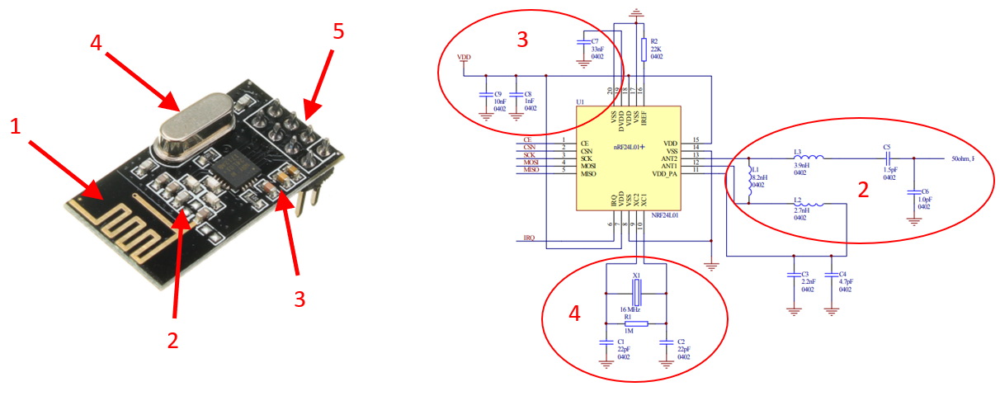

# NRF24

In heel veel toepassing komt het wel eens voor dat er nood is aan draadloze communicatie, maar in sommige gevallen kan het gebruik van WiFi of Bluetooth uit den boze zijn wegens te complex of een te groot vermogensverbruik. Denken we hierbij aan IoT toepassingen waar er datacaptatie nodig is op afstand, bij robotica waar kabelverbindingen niet mogelijk zijn of zelfs domotica, om eenvoudig een schakelaar bij te plaatsen zonder dat er hoeft gekapt en geboord te worden in muren. 

Zeker bij dit laatste voorbeeld is het gebruik van een draadloze technologie die weinig vermogen vereist bijzonder belangrijk, want het toestel moet gedurende enkele jaren meegaan op één batterij. 

Als het gaat over _low power_ draadloze communicatie is Nordic Semiconductors wellicht de grootste speler op de markt. Omwille van die reden vinden we dan ook in de elektronica heel dikwijls draadloze modules terug die gebruik maken van een IC van deze fabrikant. Hierbij is de NRF24 IC wellicht de meest gekende, die ook reeds zijn _counterfeits_ kent zoals de Si24. Deze laatste is echter volledig namaak, gebasseerd op een verouderd procestechnologie waardoor het verbruik hoger ligt en de gevoeligheid een stuk slechter is.

## De draadloze module

De NRF24 alleen als IC is niet bruikbaar. Deze heeft nog allerlei randcomponenten nodig voordat deze kan gebruikt worden. In de handel zijn dan ook veel modules te vinden waarop deze IC is gemonteerd, samen met zijn randcomponenten:
1. Antenne (meestal opgenomen als PCB trace)
1. RF filter
1. Voedingsstabilisatie (condensatoren, waarbij meestal __te weinig__ is voorzien. Zie hiervoor verder bij [voedingsprobleem](#Voedingsprobleem))
1. Oscillator
1. Breakout pinnen (meestal, soms via [castellations](https://www.eurocircuits.com/blog/castellations-on-a-pcb/))

### Spectrum

De NRF24 is ontworpen om te werken in de 2,4GHz ISM band (vandaar ook zijn naam: **N**ordic **R**adio **F**requency **2**.**4**). Deze band is wellicht bij iedereen gekend als de band voor WiFi, wat klopt. De IC deelt het spectrum met deze van WiFi (en nog veel andere toepassingen, behorende tot de **I**ndustrial, **S**cientific en **M**edical werelden). 

Op bovenstaande afbeelding zijn de kanalen te vinden waarop je via WiFi kan communiceren (14 in totaal, waarbij er slechts 3 zijn die geen overlap kennen, namelijk 1, 6 en 11). Ieder kanaal neemt 22MHz in beslag. Deze grote bandbreedte is essentieel om snelheden te halen van 100'den Mbits (afhankelijk van de gebruikte modulatietechniek). Merk op dat de laagste (center) frequentie 2412MHz is, dus als ondergrens 2412-11=2401MHz. De hoogste (center) frequentie bedraagt 2484MHz, dus 2484+11=2496MHz. De ITU heeft  bepaald dat op wereldwijd niveau alle frequenties tussen 2,4GHz en 2,5GHz door iedereen zonder licentie mogen gebruikt worden. WiFi valt hier dus mooi binnen.

Voor de NRF24 is dit echter anders. Deze heeft een maximale datarate van enkele MBit's, waardoor de vereiste bandbreedte per kanaal stukken kleiner is. Voor het gemak van uitleg is de manier van moduleren achterwege gelaten (voor wie interesse hierin heeft, de NRF24 gebruikt [GFSK](https://en.wikipedia.org/wiki/Frequency-shift_keying#Gaussian_frequency-shift_keying)). Dit resulteert in veel meer kanalen die kunnen gebruikt worden.

Volgens de datasheet kan de IC gebruikt worden bij volgende frequenties:

> The nRF24L01+ is designed for operation in the world wide ISM frequency band at 2.400 - 2.4835GHz.

De NRF24 kan ingesteld worden om 125 kanalen te gebruiken, en dit elk van 1MHz bandbreedte. Het eerste kanaal start met een frequentie van 2400MHz, het volgende 2401MHz enzoverder. De aandachtige lezer zal wellicht opgemerkt hebben dat de kanalen vanaf 97 en verder niet gebruikt worden door WiFi, en dat deze dan ook bij uitstek geschikt zijn om ongestoord te communiceren. Wel is op te merken dat dit resulteert in een frequentie die buiten het door het ITU toegekende spectrum valt. 

### Vermogen

### Aansluitingen

## Het gebruikte protocol

### (Enhanced) ShockBurst

### Auto ACK

# Gebruik van de NRF24

## Voedingsproblemen

## Interfacing

### UNO

### ESP8266

### ESP32

## Voorbeeldcode

### Basis

#### UNO

#### ESP8266

#### ESP32

### Piggyback data

### IRQ's

#### UNO

#### ESP8266

#### ESP32

### Structures

#### Structure

#### Union
